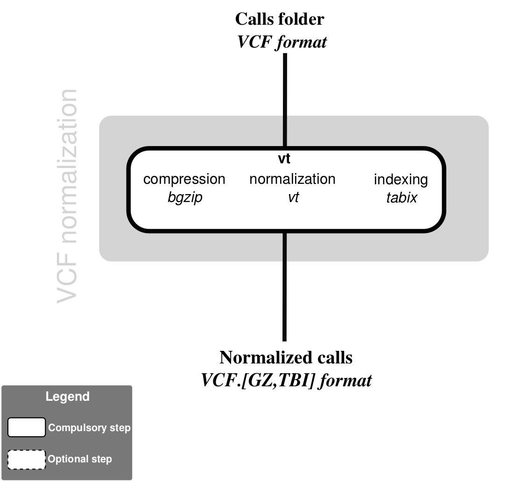

# vcf_normalization-nf

## Nextflow pipeline for vcf normalization



## Description

Apply [bcftools norm](http://samtools.github.io/bcftools/bcftools.html) to decompose and normalize variants from a set of VCF (compressed with gzip/bgzip).

This scripts takes a set of a folder containing [compressed VCF files](https://samtools.github.io/hts-specs/VCFv4.2.pdf) (`*.vcf.gz`) as an input.
It consists at four piped steps:  
  * (optional) filtering of variants (`bcftoolvs view -f`)
  * split multiallelic sites into biallelic records (`bcftools norm -m -`) and left-alignment and normalization (`-f ref`)
  * sorting (`bcftools sort `)
  * duplicate removal (`bcftools norm -d exact`) and compression (`-Oz`)

## Dependencies

1. This pipeline is based on [nextflow](https://www.nextflow.io). As we have several nextflow pipelines, we have centralized the common information in the [IARC-nf](https://github.com/IARCbioinfo/IARC-nf) repository. Please read it carefully as it contains essential information for the installation, basic usage and configuration of nextflow and our pipelines.

2. External software:  
  * [bcftools](http://samtools.github.io/bcftools/bcftools.html)  
  * [tabix](http://www.htslib.org) from `samtools/htslib`  

 **Caution**: `bcftools` and `tabix` have to be in your $PATH. Try each of the commands `bcftools` and `bgzip`, if it returns the options this is ok.

## Input

| Name      | Description   |
|-----------|---------------|
| `--vcf_folder`    | Folder containing tumor zipped VCF files |


## Parameters

  * #### Mandatory

| Name      | Example value | Description     |
|-----------|---------------|-----------------|
| `--ref`    | `/path/to/ref.fasta` |  Reference fasta file indexed

  * #### Optional

| Name      | Default value | Description     |
|-----------|---------------|-----------------|
| `--output_folder`    |  `normalized_VCF/`  | Folder to output resulting compressed vcf |
| `--filter_opt`      |  `-f PASS` | Options for bcftoolw view |
| `--cpu`    |  2  |    Number of cpus to use |
| `--mem`    |  8  |  Size of memory used for mapping (in GB) |


Note that the default is to filter variants with the PASS flag. To deactivate, use `--filter_opt " "`.


  * #### Flags

Flags are special parameters without value.

| Name      | Description     |
|-----------|-----------------|
| `--help`    | Display help |

## Usage

Simple use case example:
```bash
nextflow run iarcbioinfo/vcf_normalization-nf --vcf_folder VCF/ --ref ref.fasta
```

## Output
  | Type      | Description     |
  |-----------|---------------|
  | VCF.gz, VCF.gz.tbi       | Compressed normalized VCF files with tabix indexes|

## Contributions

  | Name      | Email | Description     |
  |-----------|---------------|-----------------|
  | Nicolas Alcala*    | alcalan@fellows.iarc.fr | Developer to contact for support |
  | Tiffany Delhomme    | delhommet@students.iarc.fr | Developer |
